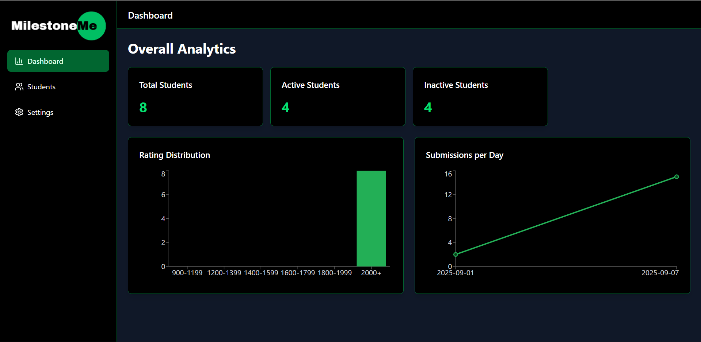
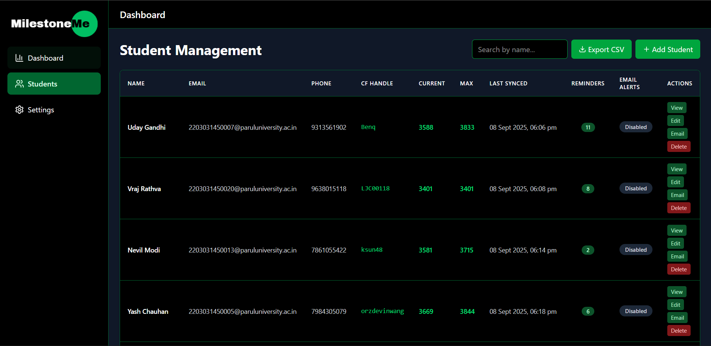
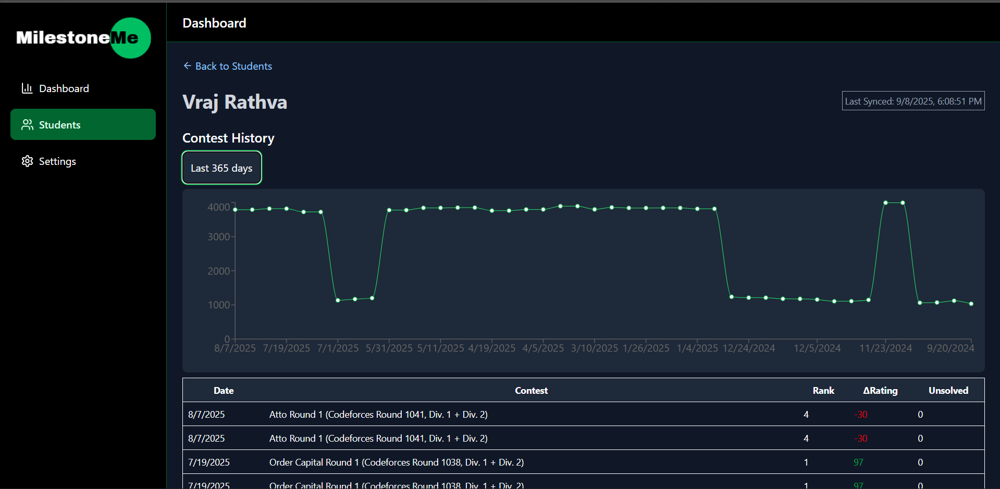
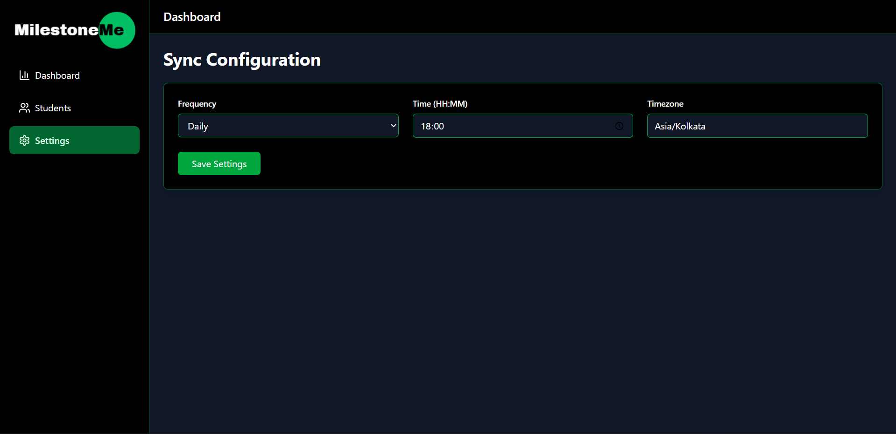
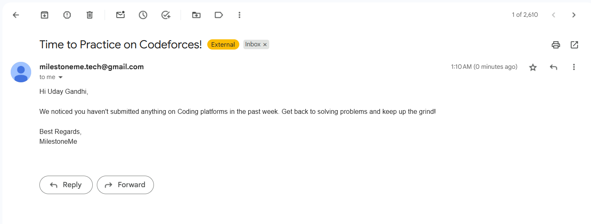
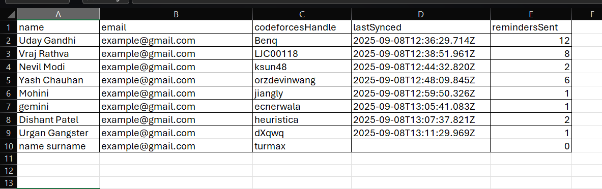
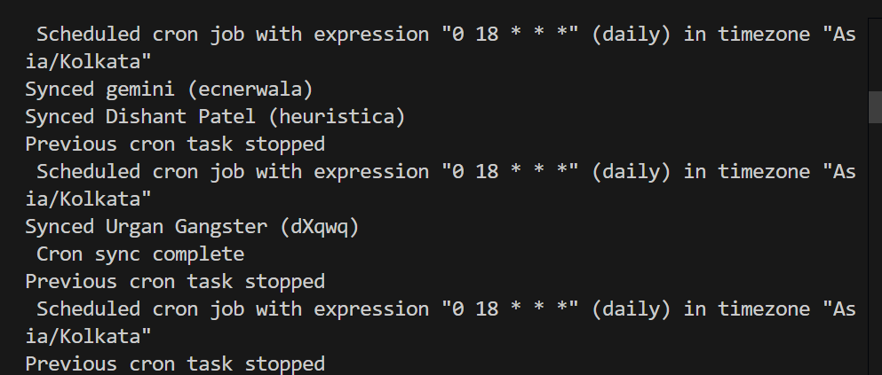

# MilestoneMe

## Project Overview
**MilestoneMe** is a platform designed to **bridge the gap between students and faculty in the coding journey**.  
The idea is to help faculty to track their students' learning progress, showcase milestones, and give guided support to students through an organized dashboard.  

Faculty can:
- Monitor student progress effectively.
- Provide timely feedback and resources.
- Identify strengths and weaknesses at a glance.
- see multiple visuals for particular student regarding his/her journey
- send automate/manual notifications to motivate students to actively perform
- detect inactive students
---

## Setup Instructions

Follow these steps to run the project locally:

### 1. Clone the Repository
```bash
git clone https://github.com/uday928/Project_MilestoneMe.git
cd Project_MilestoneMe
```

### 2. Install Dependencies
```bash 
    npm install
```

### 3. Run the project:
```bash 
    --> Run development server:
    npm start
    --> Run frontend
    npm run dev
```

## Screenshots

### 🔹 Homepage


### 🔹 Students Section


### 🔹 Student Profile


### 🔹 Settings


### 🔹 mail function


### 🔹 CSV file


### 🔹 Syncing process

